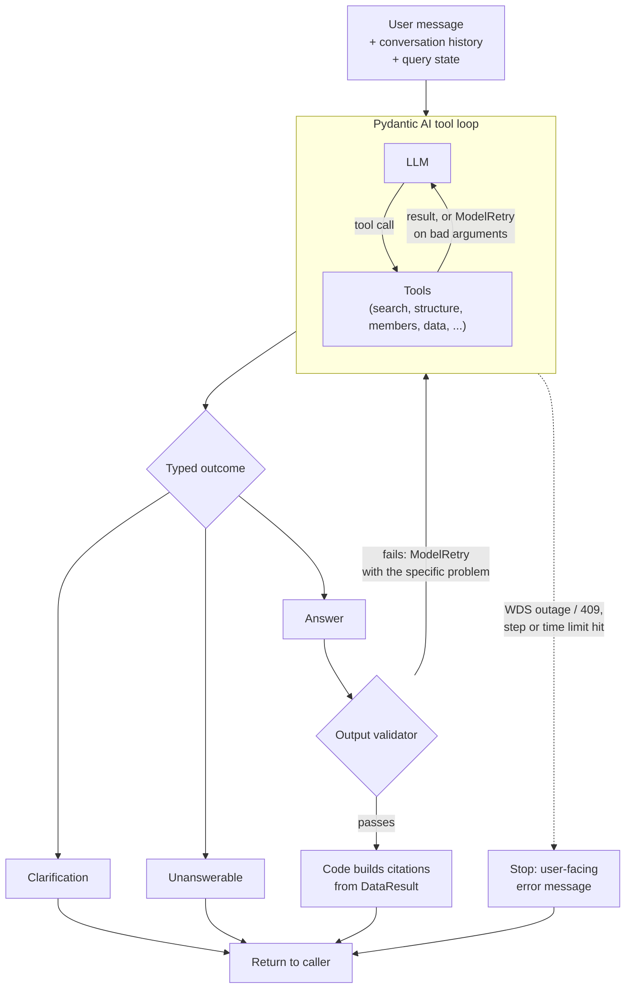
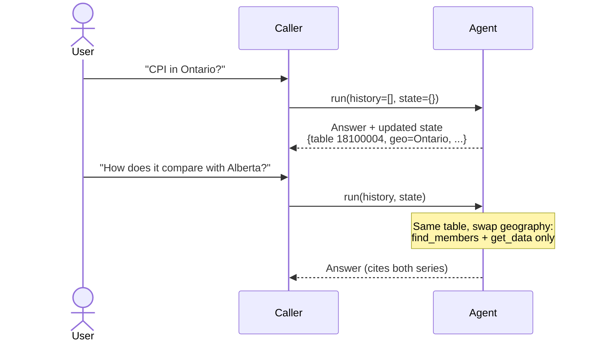
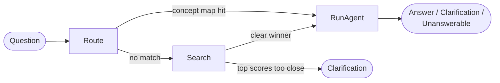

# Agent Design

How the agent turns a question into a cited answer: the loop, the output contract, memory, and
how new tools plug in. Scope, components, and the tool contract are covered elsewhere; this
doc links to them rather than repeating them:

- [mvp-scope.md](mvp-scope.md): users, scope, trust rules
- [architecture-overview.md](architecture-overview.md): where the agent sits in the system
- [mcp-tools-and-data-contract.md](mcp-tools-and-data-contract.md): tool inputs/outputs, WDS quirks
- [llm-provider-spike.md](llm-provider-spike.md): model choice

Each section is marked **Decided** (built or agreed), **Proposed** (the intended design, not
built yet), or **Open**.

## Principles

1. **The model decides what to ask for; code decides how to get it and checks the result.**
   Coordinates, fetch routing, and citations are built by code, never by the model.
2. **Trust rules are enforced in code, not only asked for in the prompt.**
3. **Start with a plain tool loop.** A step moves from the model into code only when evals
   show the model getting it wrong (see [Moving steps into code](#moving-steps-into-code)).
4. **Tool-agnostic loop.** Nothing in the loop or validator names a specific tool, so new
   tools can be added without changing them.
5. **Stateless, transport-agnostic agent.** Each run takes a message, the conversation
   history, and the query state, and returns a typed outcome, the updated history and state,
   and progress events. How the caller stores state or delivers results is outside this doc.

## The agent loop

**Decided:** Pydantic AI tool loop (`build_agent()` in `agent/agent.py`), typed outcomes
(`agent/outcomes.py`), output validation (`agent/validator.py`), and limits (#48).



### Typed outcomes (Decided)

The agent's `output_type` is a union, so every run ends in one of three explicit states rather
than free text:

| Outcome | Contains | Trust rule it encodes |
|---|---|---|
| `Answer` | plain-language text, the values used, reference period, units, quality flags, which `DataResult`s back it | 1, 2, 3, 5 |
| `Clarification` | the question to ask, candidate tables/members to choose from | 4 |
| `Unanswerable` | the reason, and the nearest thing that *can* be answered, if any | 6 |

### Output validator (Decided)

Runs on every `Answer` before it's returned. On failure it raises `ModelRetry` with the
specific problem (e.g. "169.4 does not appear in any fetched data"), within a small retry
budget (2); after that the run fails visibly rather than returning an unchecked answer.

| Check | Rule |
|---|---|
| Every number in the answer appears in a data-bearing tool result from this conversation | 5 |
| Every number in the text carries a citation marker `[n]` pointing at its entry in `values`, and every value is cited (#63) | 1 |
| (Not checked in the text: the chat endpoint sends every used `DataResult` with the answer and the app shows each one's source beneath it - see `AGENT_SYSTEM_PROMPT` in `agent/system_prompt.py`). URLs in the answer text are rejected, so the text stays plain | 1 |
| Reference period stated | 2 |
| Non-normal status / symbol on a used data point is mentioned | 3 |

How the checks read the answer: `Answer.values` lists every number stated, each traced to a
coordinate and reference period, and those are what's checked against fetched data - numbers in
the free text aren't scanned (revisit if #10's evals show numbers slipping past). The reference
period check is that each used period's year appears in the text (the full date is too fragile:
"August 2026" vs. `2026-08-01`). A flag check requires the flag's description verbatim, as the
model saw it in the tool result (e.g. "too unreliable to be published"). Guidance on *when* to
return each outcome lives in the outcome models' descriptions, not the system prompt, because the
MCP server sends that prompt to clients that have no output types.

### Limits and errors (Decided)

| Situation | Behaviour |
|---|---|
| Bad tool arguments (`ValueError` in a tool) | `ModelRetry`: the model sees the error and corrects itself (**Decided**, `agent/tools.py`) |
| WDS maintenance window (409) / outage (`WdsError`) | Stop; tell the user when to retry. No model retry. (**Decided**, propagates from `agent/tools.py`) |
| Too many steps | `DEFAULT_USAGE_LIMITS`: 12 requests / 12 tool calls per run (a typical question needs 4-6), passed to `run()` by the caller; tune from #10's data |
| Too slow | `DEFAULT_RUN_TIMEOUT_SECONDS` (60s; 30s timed out real runs that were nearly done), applied by the caller around `run()` - Pydantic AI has no run-level timeout |
| Validator keeps failing | After 2 retries the run raises `UnexpectedModelBehavior`; the caller shows an error, never the unchecked answer |

### Progress events (Proposed)

The agent emits an event per tool call via Pydantic AI's event stream (e.g. "Finding
tables...", "Fetching Ontario CPI..."), so callers can show progress during a run.

## Memory and state

**Decided:** conversation memory only, within one conversation; nothing persists across
conversations (no accounts or personalization, per [mvp-scope.md](mvp-scope.md)). The agent
holds no state between runs: the caller passes history and query state in and keeps what
comes back.

**Proposed:** two layers.

| Layer | What | Why |
|---|---|---|
| Message history | Pydantic AI `message_history`, passed into each run | Lets follow-ups ("and Alberta?") make sense |
| Query state | Small structured record: current table, resolved selections, period, `DataResult`s fetched so far | Follow-ups change one selection instead of re-searching; the validator checks numbers against it; old raw tool results can be trimmed from history without losing what was fetched |



Rules for memory:

- Numbers from earlier turns may be reused **only if they came from a tool result**, and must
  still be cited. Numbers from the model's own earlier text never count.

## Domain knowledge

StatCan knowledge lives in four places, each with a clear owner:

| Where | What | Status |
|---|---|---|
| System prompt (`agent/system_prompt.py`) | Trust rules, typical flow, general guidance. Two variants: `SYSTEM_PROMPT` for MCP clients (citations and flags in the text) and `AGENT_SYSTEM_PROMPT` + `APP_INSTRUCTIONS` for the web app (sources and flags shown by the UI; plain answers; defaults instead of clarifications) | Decided |
| Tool-result hints | Meaning attached to data from metadata, e.g. a `2002=100` unit means "index: compare changes, not levels", scalar factor, preliminary periods, and the footnotes that apply to the selected series (#38) | Proposed |
| Per-table defaults | Default members for sub-dimensions the user didn't mention (e.g. seasonally adjusted, both sexes), to fix the over-asking found in the [spike](llm-provider-spike.md) | Proposed |
| Concept-to-table map | Curated shortcuts for the most common questions (e.g. "inflation"); search covers the rest | Proposed |

Prefer the last three over growing the system prompt: they're testable and only apply where
relevant.

## Adding tools

The four MVP tools are the start, not the final set. A new tool should need no changes to the
loop or the validator. Checklist:

1. Input/output models in `mcp/schemas.py`, with `description=` text written for the LLM.
2. Tool function under `mcp/tools/`; expose it in `mcp/server.py` as well.
3. Agent wrapper in `agent/tools.py`: `ValueError` becomes `ModelRetry`; transport errors
   propagate.
4. Register it in `build_agent()`.
5. If it returns data the user will be shown, it returns (or wraps) a `DataResult`, so the
   validator and citations work unchanged.
6. One line in the system prompt's typical flow, only if the model needs to know *when* to use it.
7. Add eval questions that need it.

## Moving steps into code

**Proposed**, in the expected order, each only once evals show the need:

1. **Concept shortcut:** a concept-to-table match pre-selects the table, skipping `search_tables`.
2. **Ambiguity check:** if top search candidates score too close, return `Clarification`
   without asking the model.
3. **Default filling:** code applies per-table defaults; the model resolves only what the user
   said.

Each removes one model decision and makes that step testable on its own.

Comparisons and "by province" questions are not on this list: they're handled by the tool
itself, since WDS fetches several series in one batched request (#39).

### Using pydantic-graph for these steps (Proposed)

Once more than one or two of these steps exist, they can be organised as a small graph
**around** the agent rather than as a growing chain of `if`s. `pydantic-graph` is the natural
fit: it's already installed (Pydantic AI's own agent loop is built on it), and it's typed the
same way as the rest of the code.

What it offers:

- **Typed edges.** A node's `run()` return type declares where it can go next (e.g.
  `-> RunAgent | Search`). The graph is validated when built, and mypy checks the types.
- **Shared typed state** (`ctx.state`) carrying the query state between nodes, and a typed
  output: the same `Answer | Clarification | Unanswerable` union.
- **Each node is testable on its own**, without an LLM.
- **`graph.render()`** produces a Mermaid diagram from the code, so diagrams like the one
  below can't drift from the implementation.

**Example: routing in front of the agent** (steps 1 and 2). The agent loop stays as it is,
as one node:



```python
Outcome = Answer | Clarification | Unanswerable


@dataclass
class Route(BaseNode[QueryState, AgentDeps, Outcome]):
    async def run(self, ctx: GraphRunContext[QueryState, AgentDeps]) -> RunAgent | Search:
        if product_id := concept_to_table(ctx.state.question):
            ctx.state.product_id = product_id
            return RunAgent()
        return Search()


@dataclass
class Search(BaseNode[QueryState, AgentDeps, Outcome]):
    async def run(self, ctx: GraphRunContext[QueryState, AgentDeps]) -> RunAgent | End[Outcome]:
        candidates = search_tables(...)
        if too_close(candidates):
            return End(Clarification(question="Which of these did you mean?", candidates=...))
        ctx.state.product_id = candidates[0].product_id
        return RunAgent()


@dataclass
class RunAgent(BaseNode[QueryState, AgentDeps, Outcome]):
    async def run(self, ctx: GraphRunContext[QueryState, AgentDeps]) -> End[Outcome]:
        result = await agent.run(..., deps=ctx.deps)  # the existing tool loop, table pre-selected
        return End(result.output)


g = GraphBuilder(state_type=QueryState, deps_type=AgentDeps, input_type=Route, output_type=Outcome)
g.add(g.edge_from(g.start_node).to(Route), g.node(Route), g.node(Search), g.node(RunAgent))
router = g.build()
```

pydantic-graph also supports parallel branches (`.map()` and `join()`), but they aren't
needed for fetching several series: one batched WDS request does that with fewer calls
against the rate limit (#39).

**When to adopt:** not before the steps above actually move into code. One or two checks
before `agent.run()` don't need a graph.

## Evaluation and observability

**Proposed.**

- **Eval set:** [question-catalogue-eval.xlsx](question-catalogue-eval.xlsx), extended with
  multi-turn follow-ups ("and Alberta?", "what about last year?") and known failure cases
  (e.g. treating an index as a price level).
- **Metrics:** answer accuracy (value, period, units), correct outcome type, trust-rule
  violations caught by the validator, table found in top-3, steps per question, latency, cost.
- **Baseline:** the same questions through Claude Code using the MCP server, to measure what
  the purpose-built agent adds.
- **Per-run log:** tool calls and arguments, retries and their reasons, validator rejections,
  outcome type, tokens, latency. This is what tells us which steps to move into code.

## Alternatives considered

| Alternative | Why not (for now) |
|---|---|
| Fixed pipeline (understand → find table → resolve → fetch → write) | Rigid, and we don't yet know which steps the model gets wrong. Steps move into code one at a time instead. |
| Free-text answers checked only by the prompt | Can't guarantee citations or trace numbers to data. |
| Long-term / cross-session memory | Out of MVP scope; needs accounts; privacy and hosting concerns. |
| LangGraph | Its strengths (checkpointed state, mid-run interrupts) solve problems this design avoids by keeping the agent stateless; weaker typing than the Pydantic schemas; rework of `agent/tools.py`. `pydantic-graph` covers the graph use case above. |

## Open questions

- Retry budget and step/time limits: set from eval data, not guessed.
- Whether derived figures (e.g. % change) stay out of scope; if allowed, code computes them,
  never the model.
- Model routing: whether hard questions should go to a stronger model.
