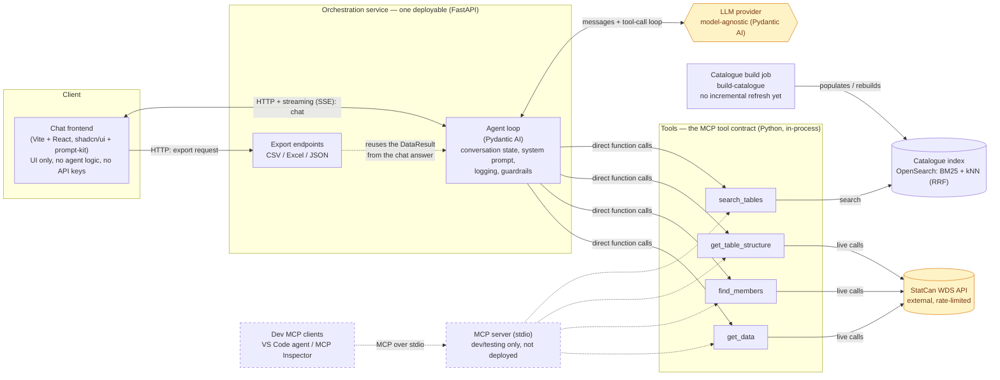
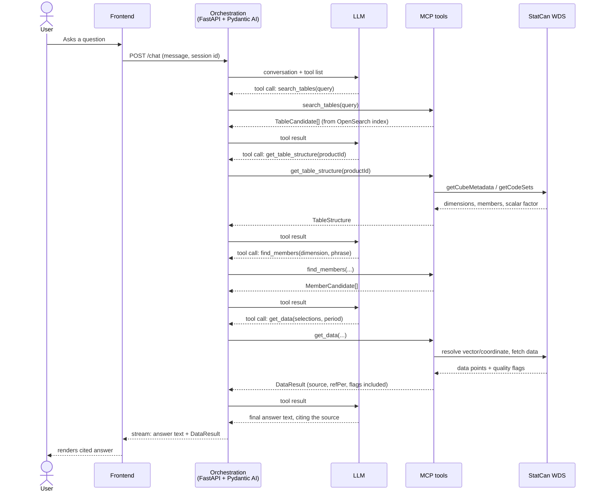
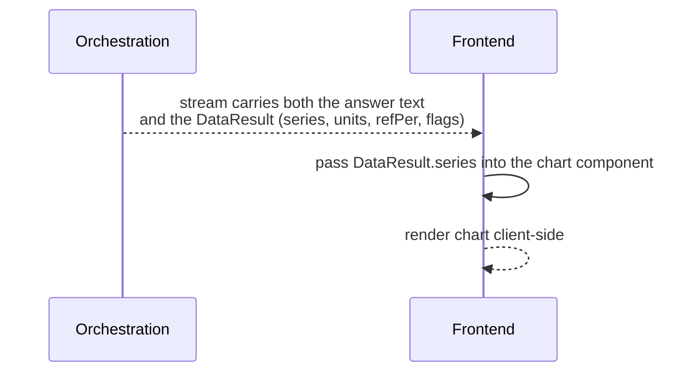
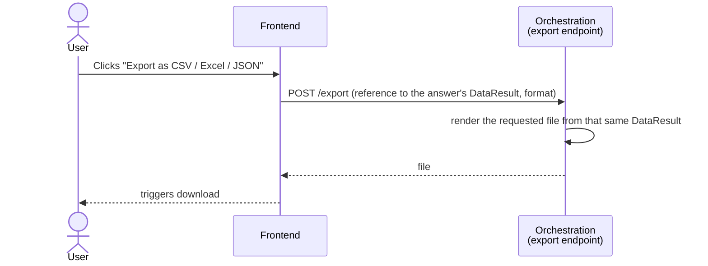

# Architecture Overview: StatCan Natural-Language Data Assistant

This document describes the MVP architecture: the components, how a question flows through them, and the key decisions behind the shape of the system. It assumes the scope in [mvp-scope.md](mvp-scope.md) and the tool contract in [mcp-tools-and-data-contract.md](mcp-tools-and-data-contract.md).

## Component diagram

External systems (amber) are outside this team's control: the StatCan WDS API and the LLM provider. Dashed boxes are development tooling, not part of the deployed product. Everything else is built and deployed by this project.

## Components, one paragraph each

**Chat frontend (Vite + React).** Renders the conversation, streams the agent's response as it arrives, draws charts from structured data the orchestration service sends alongside the text, and exposes export buttons. It holds no agent logic and no LLM or StatCan credentials — it only talks to the orchestration service over a small custom SSE protocol we define ourselves (see [TECH_STACK.md](../TECH_STACK.md) for why this is hand-rolled rather than built on a third-party chat framework's runtime).

**Orchestration service (FastAPI + Pydantic AI agent).** The one deployable unit for the MVP. FastAPI provides the HTTP/streaming surface the frontend talks to, holds conversation state across requests (HTTP itself is stateless), and hosts the export endpoints and logging/guardrail middleware. Pydantic AI runs the actual agent loop inside that process: it sends the conversation and tool list to the LLM, executes whatever tools the LLM calls, validates tool-call arguments against the same Pydantic schemas that define the MCP tool contract, feeds results back, and repeats until there's an answer to stream out.

**Tools (the MCP tool contract).** The four tools from the [data contract](mcp-tools-and-data-contract.md): `search_tables`, `get_table_structure`, `find_members`, `get_data` — plain Python functions in `src/open_data_assistant/mcp/tools/`, typed by the Pydantic schemas in `mcp/schemas.py`. The agent calls them in-process as ordinary function calls for the MVP (see Key Decisions). Separately, a thin stdio MCP server (`uv run mcp-server`, `mcp/server.py`) wraps the same functions so they can be called directly from an MCP client such as VS Code's agent mode during development; it isn't deployed, and it's the natural starting point if the tools are ever split into their own service. This is the only place that builds a StatCan coordinate or decides between a vector-based and coordinate-based fetch — the LLM never does this itself.

**Catalogue index (OpenSearch).** Backs `search_tables`. Holds the denormalized product catalogue — bilingual titles, subjects, near-root dimension members, coverage dates, frequency — ranked by a BM25 + kNN hybrid fused with reciprocal rank fusion. This already exists and is populated (see the DataDiscovery repo).

**Catalogue build job.** Populates and rebuilds the OpenSearch index from WDS's `getAllCubesList` plus a chunked `getCubeMetadata` enrichment pass. Currently a manual, full rebuild (`build-catalogue`) — there is no incremental daily refresh yet (`getChangedCubeList` is docs-only, unimplemented). Whether that's needed for MVP or can wait is an open item.

**StatCan WDS API.** The external system of record for all data. Rate-limited (25 req/sec per IP, 50 req/sec server-wide), has a maintenance window (HTTP 409 between midnight and 8:30 AM ET), and the quirks documented in the data contract. Only the tools call it.

**LLM provider.** External, and deliberately not hard-coded into the orchestration service — Pydantic AI's model abstraction keeps this swappable by config rather than by rewriting agent code. OpenAI's `gpt-5-mini` is the chosen starting model (see Key Decisions and [docs/llm-provider-spike.md](llm-provider-spike.md)) — validated for answer accuracy and the catalogue's harder cases, though only one provider was actually compared and retrieval accuracy (`search_tables`) wasn't exercised, both tracked as follow-up there.

## Sequence: question → answer

Every tool call in this chain is the LLM's decision about *what* to ask for; the MCP server decides *how* to get it from WDS. If any step is ambiguous (multiple table candidates, an unresolved member phrase), the agent asks the user instead of guessing, per the [MVP scope](mvp-scope.md)'s trust rules.

## Sequence: answer → chart

There's no separate "generate a chart" round trip. The same `DataResult` object that backs the written answer is what the frontend charts — this is why the [data contract](mcp-tools-and-data-contract.md) insists on one standard shape: a chart and a chat answer built from two independently-fetched copies of "the same" data could disagree, especially around suppressed values or scalar factors.

## Sequence: answer → export

Exports are generated server-side from the same `DataResult` already produced for the chat answer, not re-fetched from WDS. This guarantees the exported numbers match what the user was just told, and avoids spending a second round of WDS rate-limit budget on data already in hand.

## Key decisions

| Decision | Reasoning |
|---|---|
| **Orchestration service in Python (FastAPI)** | The existing WDS exploration and DataDiscovery repos are already Python/uv. Keeping the backend in Python avoids splitting the stack across two languages for one small team, and avoids discarding the working, tested DataDiscovery search stack. |
| **Pydantic AI as the agent framework** | Model-agnostic across major providers, has native MCP client support so the MCP server's tools plug in directly, and validates tool-call arguments against Pydantic schemas — which doubles as the "schemas as code" deliverable rather than being a second artifact to maintain. |
| **LLM provider: OpenAI `gpt-5-mini`** | Picked via a validation spike against the [question catalogue](question-catalogue-eval.xlsx) rather than an upfront guess: 100% answer accuracy on every row it completed, including both harder catalogue rows it reached (disambiguation, negative case). Conservative about asking clarifying questions on multi-sub-dimension tables rather than defaulting — a prompt tweak to try before assuming it's a model limitation. Only one provider was compared (budget/key availability) and retrieval accuracy wasn't measured (`search_tables` needs OpenSearch, not running yet) — see [docs/llm-provider-spike.md](llm-provider-spike.md) for the full numbers and what's still open. |
| **Frontend built on shadcn/ui + prompt-kit, with a hand-rolled SSE client, rather than an off-the-shelf AI chat framework** | Evaluated assistant-ui, CopilotKit (AG-UI), Chainlit, LibreChat, and Open WebUI. Each either assumes a specific backend protocol (Vercel AI SDK, AG-UI) with no proven Pydantic-AI-specific path, or is a full product that wants to own the backend/storage/auth stack itself — which conflicts with keeping FastAPI + Pydantic AI as the real backend. Since we control both ends of the wire format, a small custom SSE client removes that entire category of integration risk; shadcn/ui and prompt-kit (same "copy the source, own it" distribution model, both backend-agnostic) still give most of the UI building blocks for free. See [TECH_STACK.md](../TECH_STACK.md) for the full evaluation. |
| **MCP server runs in-process with the orchestration service for the MVP** | Fewer moving parts to deploy and debug while the tool set and data contract are still settling. MCP is a standard protocol regardless of process boundary, so splitting it into its own service later (e.g. for reuse by Claude Desktop or another team) doesn't require redesigning the tools. |
| **The LLM never builds a coordinate or decides the fetch route** | Coordinate-building and vector/coordinate routing are mechanical and validatable; the MCP server does them the same way every time. This is as much a trust/accuracy decision ([MVP scope](mvp-scope.md)) as an architectural one. |
| **Export is generated server-side from the same `DataResult` as the chat answer, not re-fetched** | Guarantees the exported numbers match the cited answer, and avoids a second round of WDS calls against the per-IP rate limit for data already fetched. |
| **Charts are rendered client-side from structured data, not server-rendered images** | Keeps hover/tooltip interactivity in the chat UI and avoids standing up server-side chart-rendering infrastructure for the MVP. |
| **OpenSearch with hybrid BM25 + kNN (RRF) for the catalogue index** | Already built and populated in the DataDiscovery repo, with a working (if currently disposable) proof that hybrid ranking outperforms either signal alone on StatCan's catalogue of ~8,000 tables. |

## Open questions

- **LLM provider comparison**: only OpenAI `gpt-5-mini` has been validated (see [docs/llm-provider-spike.md](llm-provider-spike.md)). Comparing other providers/tiers, measuring retrieval accuracy once OpenSearch is running, and re-testing with a multi-turn harness are all tracked there as follow-up, not blockers for MVP.
- **Hosting constraints** (government cloud, data residency): unresolved. This could affect where the orchestration service and OpenSearch index are allowed to run, and may itself constrain which LLM providers are usable.
- **Catalogue refresh cadence**: no incremental refresh job exists yet. Worth deciding whether the MVP needs one or can run on periodic full rebuilds.
- **Caching layer**: not yet designed. `get_table_structure` and `find_members` results are stable enough to cache, but for how long, and where (in-process, Redis, etc.), isn't decided.
