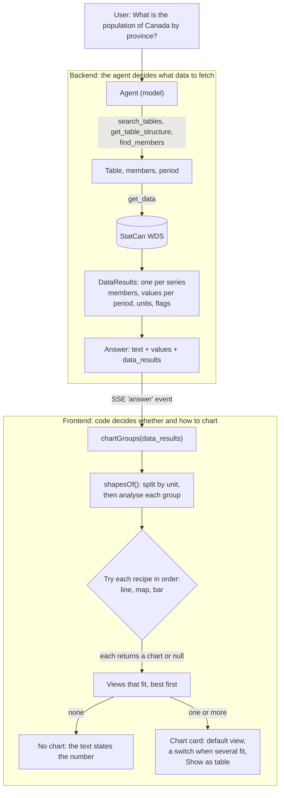
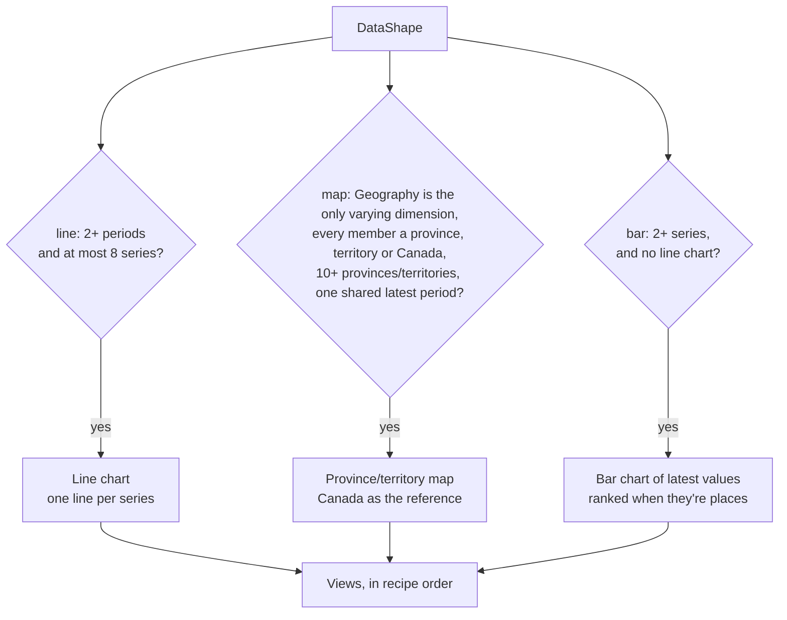

# Charts: how an answer gets its chart

**The model never decides about charts.** It fetches data and writes the answer's text. The
browser decides whether to draw a chart, and which kind, from the *shape* of the data that came
back, using a fixed list of **chart recipes**. The chart is built from the same `DataResult`s
that back the cited numbers, so the two can't disagree (see
[architecture-overview.md](architecture-overview.md), "answer → chart").

Code: `frontend/src/chat/chartSpec.ts` (types, `chartGroups`), `frontend/src/chat/charts/`
(the shape analysis, the recipes, the map's provinces and outlines), and
`frontend/src/components/chat/AnswerChart.tsx` (the views).

## From question to chart

The agent's instructions influence *what* is fetched (e.g. "for a question across provinces,
fetch them all at one period"), which in turn decides which recipes fit. But nothing the model
writes asks for a chart, picks its type, or draws it.

## Step 1: the data's shape

`shapesOf()` (`charts/recipes.ts`) first splits the series by **unit**: two units never share
an axis, so percent and dollars get separate charts. Each group becomes a `DataShape`:

| Field | Meaning | Population by province |
|---|---|---|
| `results` | The series | 14 (Canada + 13) |
| `periods` | Every reference period, oldest first | `2026-07-01` |
| `varying` | Dimensions whose members differ between the series | `Geography` |
| `names` | What tells the series apart | "Ontario", "Quebec", … |
| `title` | What they have in common | "Population estimates, quarterly" |

## Step 2: the recipes

A **recipe** is a function from a shape to a chart, or `null` when that kind of chart doesn't
fit. All recipes are tried in order; every chart that fits is offered, and the first is the
default.

| Recipe | Applies when | Why |
|---|---|---|
| **line** | 2+ periods, at most 8 series | The categorical palette has 8 validated colours; a 9th series is never a new colour |
| **map** | Only Geography varies; every member is a province, territory or Canada; 10+ provinces/territories; one shared period | A city mixed in, or a second varying dimension (e.g. men and women: two values per province), would make the map hide or misstate data, so there's no map then |
| **bar** | 2+ series, when there's no line chart | Compares series at their latest value; places are ranked (Canada in grey as the reference), other dimensions keep the table's order |

### Examples

| Question | Shape | Views |
|---|---|---|
| Ontario unemployment, last 12 months | 1 series, 12 periods | Line |
| Ontario vs Alberta CPI, 13 months | 2 series, 13 periods | Line |
| Population by province | 14 series, 1 period, Geography only | **Map**, Bar |
| 13 provinces over 5 years | 13 series: too many lines | **Map** of the latest period, Bar |
| Unemployment by age group | Several series, 1 period, Age varies | Bar |
| Ontario's population today | 1 series, 1 period | None |

## The province/territory map

- **Colour:** one hue in 5 equal steps from lowest to highest (`--seq-1…5` in `index.css`, with
  separate steps for dark mode), and a legend.
- **No data:** a province the data doesn't cover is hatched grey and labelled "No data", never
  coloured as if it were a low value.
- **Reading it:** hover or keyboard focus shows a province's value; with nothing hovered,
  Canada's value is shown as the reference. "Show as table" lists every province and territory.
- **Outlines:** Natural Earth (public domain), projected to Statistics Canada's Lambert and
  simplified to 12 KB in `charts/provinceShapes.ts`, built by
  `frontend/scripts/build-province-map.mjs`. Province level only; no cities or census areas.

## Adding a chart type

1. **A recipe** in `charts/recipes.ts`: a function taking a `DataShape` and returning its chart
   spec, or `null` when it doesn't fit. Add it to `RECIPES` where it should rank.
2. **A spec type** in `chartSpec.ts`, added to the `ChartSpec` union.
3. **A view** in `AnswerChart.tsx` (and a label for the switch), plus its rows in "Show as
   table".
4. **Tests** in `charts/recipes.test.ts`: when it applies, and when it must not.

Candidates: grouped bars by sex or gender; a population pyramid (Age and Sex both vary); change
between two periods (a diverging bar or map).
