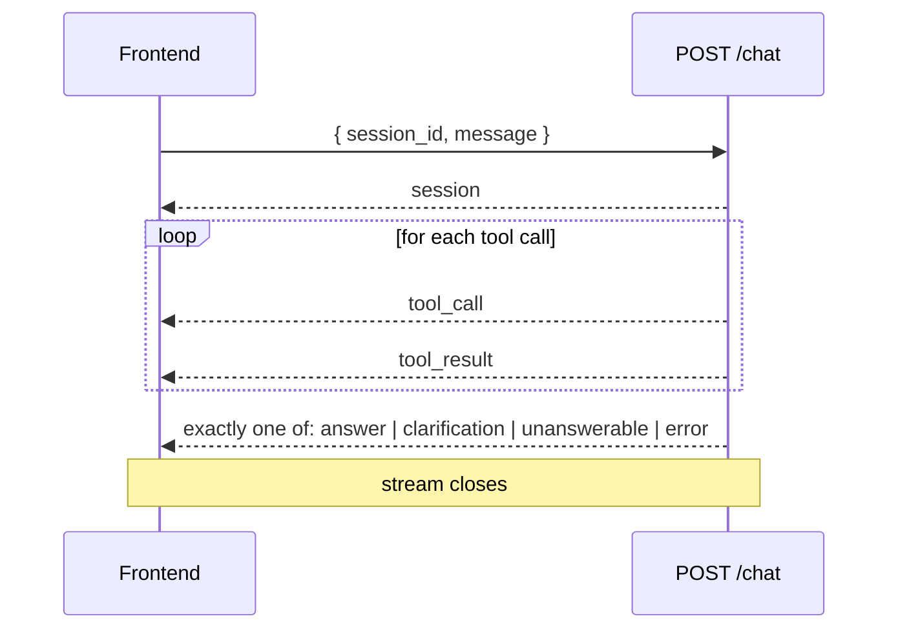

# Chat API: `POST /chat` and its event stream

The contract between the chat endpoint (#11) and the frontend's stream client (#14). Both
sides, and the frontend's mock streams, are written against this doc, so change it first.

Payload shapes come from the agent's outcome models
([agent/outcomes.py](../src/open_data_assistant/agent/outcomes.py)) and `DataResult`
([mcp-tools-and-data-contract.md](mcp-tools-and-data-contract.md)); this doc doesn't repeat
their fields.

## Request

```http
POST /chat
Content-Type: application/json

{ "session_id": "3f2c…", "message": "How does Ontario's CPI compare with Alberta's?" }
```

- `session_id`: omit or `null` to start a new conversation; the server creates one and returns
  its ID in the first event. Send it back with every later message.
- `message`: the user's text, 1-2000 characters.
- `table_id` (optional): a table the user picked while browsing or from a table's details ("Ask about this table", #56). The agent is told for that run to answer from it and skip searching; if the question can't be answered from it, it says so.

Errors **before** the stream starts are plain HTTP responses with a JSON body
`{"detail": "..."}`:

| Status | When |
|---|---|
| 400 | Invalid body (missing/empty/too-long message) |
| 404 | Unknown `session_id` (e.g. the server restarted: sessions are in memory) |
| 409 | That session is already answering a message |

## Response: an SSE stream

`200 OK`, `Content-Type: text/event-stream`. Each event is standard SSE framing with a JSON
`data` line:

```text
event: tool_call
data: {"call_id": "c1", "label": "Searching StatCan tables"}

```

The frontend reads it with `fetch` + `ReadableStream` (not `EventSource`, which can't POST).



Every stream starts with `session` and ends with **exactly one** terminal event, then closes.
A stream that closes without a terminal event was cut off; the frontend shows a generic error.

## Events

### `session` (first event)

```json
{ "session_id": "3f2c…", "message_id": "m7" }
```

`message_id` identifies this exchange, e.g. for exporting its data later (#12).

### `tool_call` and `tool_result` (progress)

```json
{ "call_id": "c3", "label": "Fetching data for 2 series", "tool": "get_data" }
{ "call_id": "c3", "ok": true, "detail": "Ontario, Alberta · 2026-08" }
```

- `label` is written by the server in plain language, so the frontend just displays it.
- `tool` (optional) on `tool_call` is the tool's name (`search_tables`, `get_table_structure`,
  `find_members`, `get_data`), e.g. so the frontend can say "Writing the answer..." once data
  has been fetched.
- `detail` (optional) on a successful `tool_result` is one line on what the step found, from
  the tool's own result, shown under the step: the top matching table
  ("Top match: Labour force characteristics... (14-10-0287-01)"), the table's dimensions, the
  members found, or what was fetched and for when ("Canada ... British Columbia x Men+, Women+ ·
  2026-09").
- `ok: false` means the tool call failed and the agent is retrying with different arguments
  (a normal part of a run, not an error to show the user). Optional `"message"` says why.
- Purely for showing progress: the frontend must not need them to render the answer.

### Terminal events

`answer`: the validated `Answer`, plus every `DataResult` its values came from.

```json
{
  "message_id": "m7",
  "text": "Prices rose faster in Alberta: … ([Alberta, All-items (v41692327)](https://…)) …",
  "values": [
    { "coordinate": "23.2.0.0.0.0.0.0.0.0", "ref_per": "2026-08-01", "value": 179.2 }
  ],
  "data_results": [ { "…": "DataResult" } ],
  "related_tables": [ { "…": "TableCandidate" } ]
}
```

- `text` is markdown with **citation markers**: each series is cited once, with `[n]` after its first mention, where `n` is the 1-based position in `values` of a value from that series (e.g. `7.0% [1]`). The backend validator guarantees every marker points at a value and every series is cited, and the text has no URLs. The frontend shows the markers as numbered links to each source (#63).
- `data_results` holds only the series the answer used (matched by `coordinate` from
  `values`), in the order first used. These are what the chart draws and the export
  contains, so they're never re-fetched.
- `related_tables` (optional, may be absent or empty): up to 5 other tables that may interest
  the user, as `TableCandidate`s ([mcp-tools-and-data-contract.md](mcp-tools-and-data-contract.md)).
  They're the run's own `search_tables` results minus the tables the answer used, in search
  rank order; if the run didn't search (common for follow-ups), they're the active tables
  most similar to the one used, by catalogue embedding. Suggestions only: metadata, never
  data, and not what the answer is based on. Built by `agent/related.py` (#54).

`clarification`:

```json
{ "message_id": "m7", "question": "Which inflation measure do you mean?",
  "options": ["Consumer Price Index, all-items", "12-month % change in the CPI"] }
```

The frontend can show `options` as buttons; clicking one sends its text as the next message.

`unanswerable`:

```json
{ "message_id": "m7", "reason": "Census tables have no quarterly data.",
  "alternative": "The 2016 and 2021 census counts." }
```

`alternative` may be `null`.

`error`: the run failed; nothing from it should be shown as an answer.

```json
{ "message_id": "m7", "code": "wds_unavailable", "message": "Statistics Canada updates its data overnight, until 8:30 AM ET. Try again after that.", "retryable": true }
```

| `code` | Cause | `retryable` |
|---|---|---|
| `wds_unavailable` | WDS maintenance window (409) or outage | true |
| `validation_failed` | The agent couldn't produce an answer that passes the trust checks within its retries | true |
| `limit_exceeded` | The run hit its tool-call/request limit | false |
| `timeout` | The run exceeded its time limit | true |
| `internal` | Anything else (logged server-side) | true |

`message` is safe to show the user as-is.

## No streamed answer text (for now)

Ticket #11 originally listed text deltas. This format deliberately has none: the answer
arrives whole, in the terminal event, **after** the output validator has checked it.

The model writes its answer as a structured `Answer`, and the validator can reject it and
make the model try again. Streaming the text as it's written would show the user numbers
and citations that might then be rejected, which is exactly what the trust rules exist to
prevent. Progress events cover the wait, and answers are short.

Revisit if the evals (#10) show long waits. Adding a `text_delta` event later doesn't break
this format, as long as the frontend ignores unknown event types (which it must).

## Compatibility rules

- The frontend **ignores unknown event types** and unknown fields.
- The server may add events and fields, but doesn't rename or remove them without updating
  this doc and the frontend together.

## Mocks

The frontend's mock streams (`frontend/src/mocks/*.sse`) are hand-written from this doc at
first, then replaced with recordings of real streams once #11 works, so they can't drift from
what the server actually sends.
